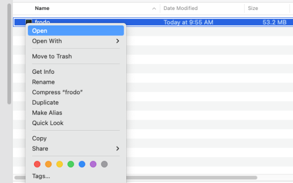
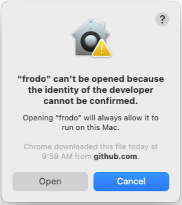

# `frodo` binary distribution
Prebuilt binaries for major OSes (MacOs, Windows and linux) are available on the [releases page](https://github.com/rockcarver/frodo/releases). These binaries can be run without and prerequisites or dependencies and are the **easiest and fastest** way to start using `frodo`. But, these binaries are not signed and hence are untrusted by MacOS and Windows. As a result, these OSes may not let you run frodo the very first time just after downloading and unzipping it. Follow these simple steps to get frodo binaries working on MacOS and Windows.

## MacOS
- When frodo is run from a terminal for the first time, you may see a popup like below

- You can either click "Show in Finder" or open Finder yourself and navigate to where the `frodo` binary is.
- **Right click** on `frodo` and then click **Open**

- Another popup, like below, will show 

- Click **Open** in this popup. A terminal window will open and then exit (it will be quick).
- Now you will be able to run `frodo` in the terminal

## Windows
To be added...