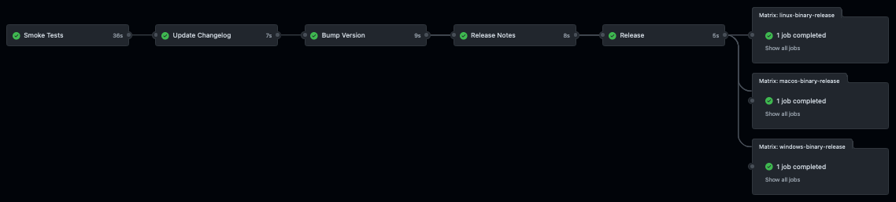
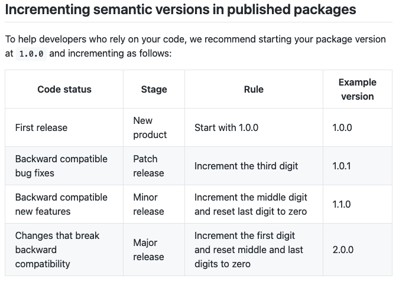

# Frodo Release Pipeline

The Frodo project uses a fully automated release [pipeline](../.github/workflows/pipeline.yml) based on GitHub workflows:



## Releasing Frodo

This information is only actionable if you are an active contributor or maintainer with appropriate access to the repository and need to understand how frodo releases work.

### Every Push Triggers A Release

Frodo adopted the principle of continuous integration. Therefore every push to the main branch in the [rockcarver/frodo] repository trigger the automated release pipeline.

The pipeline determines the type of release - `prerelease`, `patch`, `minor`, `major` - for the push:

- Scans the commit and PR comments for trigger phrases:
  - `PATCH RELEASE` triggers a `patch` release
  - `MINOR RELEASE` triggers a `minor` release
  - `MAJOR RELEASE` triggers a `major` release
  - Everything else triggers a `prerelease`
- Bumps the version accordingly:<br>
  `<major>`.`<minor>`.`<patch>`-`<prerelease>`
- Updates the [changelog](../CHANGELOG.md) file in [keep a changelog](https://keepachangelog.com/en/1.0.0/) format:
  - Creates a new release heading using the bumped version and a date stamp
  - Moves the content of the `Unreleased` section into the new section
  - Adds release details links

❗❗❗ IMPORTANT ❗❗❗<br>
Contributors are instructed to submit pull requests. Maintainers must make sure none of the commit comments nor the PR comment contain trigger phrases that would cause the pipeline to perform an undesired version bump and release.

### Automatic Pre-Releases During Iterative Development

The default release type (if no specific and exact trigger phrases are used) results in a pre-release. Pre-releases are flagged with the label `Pre-release` on the [release page](../releases) indicating to users that these releases are not considered final or complete.

Pre-releases are a great way to get the latest and greatest functionality but they are not fully polished, readme and changelog might not be updated and test coverage might not be complete.

### Triggering Patch, Minor, and Major Releases

Maintainers must validate PRs contain an updated `Unreleased` section in the[changelog](../CHANGELOG.md) before merging any PR. Changelog entries must adhere to the [keep a changelog](https://keepachangelog.com/en/1.0.0/) format.

Maintainers must use an appropriate trigger phrase (see: [Every Push Triggers A Release](#Every-Push-Triggers-A-Release)) in the PR title to trigger the appropriate automated version bump and release.

❗❗❗ IMPORTANT ❗❗❗<br>
Maintainers must adhere to the [guidelines set forth by the npm project](https://docs.npmjs.com/about-semantic-versioning#incrementing-semantic-versions-in-published-packages) to determine the appropriate release type:



Frodo is currently in a pre-1.0.0 phase. We are striving to release 1.0.0 very soon.

## Current Pipeline Explained

### Trigger Event

The trigger event is any `push` to the `main` branch in the repository.

### Update Changelog

This step calculates the new version but doesn't modify `package.json` and `package-lock.json`. Based on that new version, it creates a new heading in the [CHANGELOG.md](../CHANGELOG.md) file and moves everything from the `Unreleased` section into the new version section. It also creates links to the release tags at the bottom of the [CHANGELOG.md](../CHANGELOG.md) file. Last but not least, it commits the updated [CHANGELOG.md](../CHANGELOG.md) file to the repository.

#### 3rd-Party Actions

-   [gh-action-bump-version](https://github.com/phips28/gh-action-bump-version): phips28/gh-action-bump-version@master
-   [keep-a-changelog-new-release](https://github.com/thomaseizinger/keep-a-changelog-new-release): thomaseizinger/keep-a-changelog-new-release@1.3.0

### Bump Version

This step calculates the new version and corresponding tag, updates both [package.json](../package.json) and [package-lock.json](../package-lock.json) and commits the changes to the `main` branch.

#### 3rd-Party Actions

-   [gh-action-bump-version](https://github.com/phips28/gh-action-bump-version): phips28/gh-action-bump-version@master

### Release Notes

This step extracts the changes under the heading that matches the release version and uses it as the release notes. For pre-releases it also generates a section of changes based on commits that were part of the release.

Good release notes require the contributor and/or maintainer take the time and update the [CHANGELOG.md](../CHANGELOG.md) file. Auto-generated release notes based on commit comments are less than optimal but acceptable for pre-releases.

Patch, minor, and major releases require a carefully curated [CHANGELOG.md](../CHANGELOG.md) file.

#### 3rd-Party Actions

-   [submark](https://github.com/dahlia/submark): dahlia/submark@main


### Release

This step creates a GitHub release based on the tag created in a previous step and posts a number of artifacts:

-   [CHANGELOG.md](../CHANGELOG.md)
-   [LICENSE](../LICENSE)
-   `Release.txt` - Generated for each release containing the git sha of the release
-   `<tag>.zip` -  Generated for each release containing the full repository as a `.zip` archive
-   `<tag>.tar.gz` - Generated for each release containing the full repository as a `.tar.gz` archive

_Note:_ this step does not include the frodo binaries!

#### 3rd-Party Actions

-   [action-gh-release](https://github.com/softprops/action-gh-release): softprops/action-gh-release@v1

### Binary Releases

The binaries are built by GitHub runners of the same OS as the binary they are building. That allows the binaries to be executed (tested) as one of the steps in the build process.

The binary builds run in parallel while all the previous steps run in sequence and must complete before the binay builds even kick off.

#### Linux Binary Release

This step builds the Linux binary and adds it to the release created in an earlier step.

#### 3rd-Party Actions

-   [action-gh-release](https://github.com/softprops/action-gh-release): softprops/action-gh-release@v1

#### Mac OS Binary Release

This step builds the Mac OS binary and adds it to the release created in an earlier step.

#### 3rd-Party Actions

-   [action-gh-release](https://github.com/softprops/action-gh-release): softprops/action-gh-release@v1

#### Windows Binary Release

This step builds the Windows binary and adds it to the release created in an earlier step.

#### 3rd-Party Actions

-   [action-gh-release](https://github.com/softprops/action-gh-release): softprops/action-gh-release@v1

## Pipeline Maintenance

Pipeline maintenance is a tricky business. Pipeline testing in forks is difficult because GitHub by default imposes a different behaviour for pipeline events than in the main repository. Some pipeline steps require branch names, which means the pipeline needs to be adopted to run in the fork and branch it is being tested in.

All of the above has lead the team to make and test pipeline changes in the main repository on the real pipeline.

### Recover From A Wrong Version Bump And Release

When testing the pipeline and especially when experimenting with the automated version bump logic, it is unavoidable that once in a while a version is released that really has to be removed. E.g. during the pipeline development and testing of the first full automation, a bump to version 1.0.0 was triggered unintentionally. While minor and patch version bumps can be dealt with, major version bumps should really not be taken lightly.

So to recover from that, the following needs to happen:

1.  Manually delete the `faulty release` from the [release page](../releases)
1.  Manually modify the following files in your fork:
    -   [CHANGELOG.md](../CHANGELOG.md)
        1.  Find the faulty release heading towards the top of the file
            1.  Move your changelog entries in the faulty release section back into the Unreleased section
            1.  Now remove the faulty release header
        1.  Find the link to the faulty release tag at the bottom of the file and remove it
    -   [package.json](../package.json)
        -   Fine the 1 occurance of the frodo version in package.json and reset it to the `previous version` from before the faulty version bump
    -   [package-lock.json](../package-lock.json)
        -   Find the 2 occurances of the faulty version in package-lock.json and reset them to the `previous version` from before the faulty version bump
1.  Commit your changes and create a new pull request
1.  In the frodo repository, merge the PR and provide the appropriate comment to trigger the intended version bump
1.  Remove the faulty tag from the repository:<br>
    This is important because you cannot update an existing tag and in order to eventually release the version in the future, you must delete it first. Beware the difference between version (e.g. `1.0.0`) and tag (e.g. `v1.0.0`). This step requires you to use the tag:
    -   From the command line, navigate to the directory where you cloned the frodo repository (_not your fork, the real one!_)
    -   Issue the following command:<br>
        ```
        git push --delete origin v1.0.0
        ```
1. Validate the pipeline created the desired new version and release